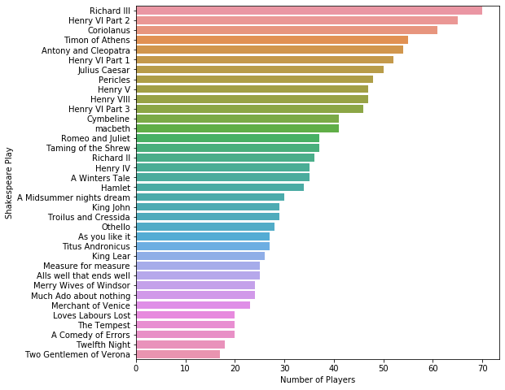
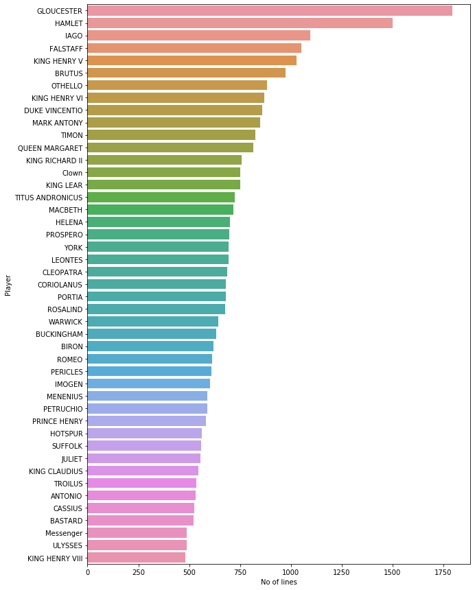
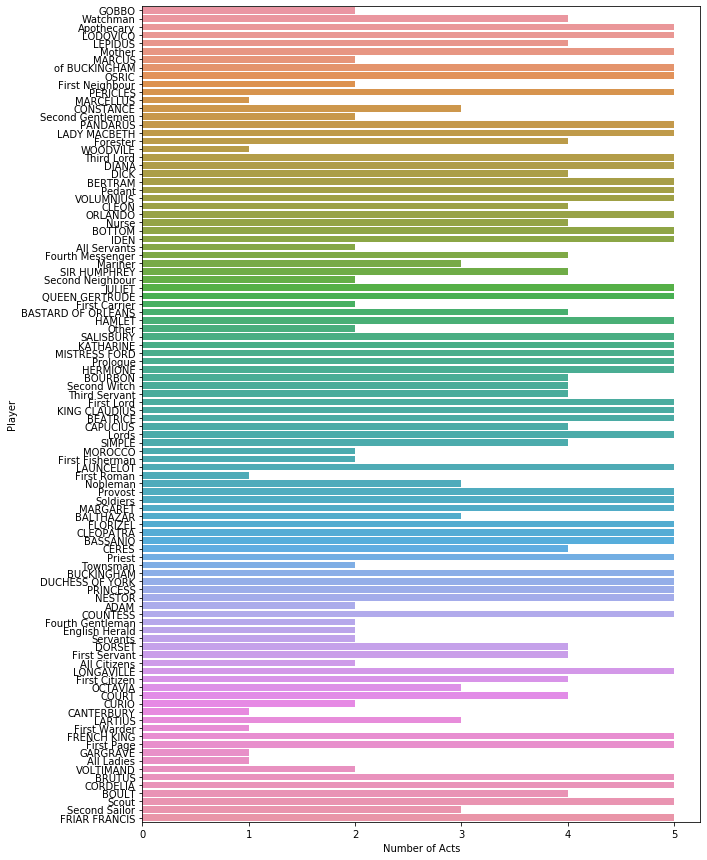

```python
import pandas as pd
import numpy as np
import seaborn as sns
import matplotlib.pyplot as plt
import nltk
import string
from nltk.corpus import stopwords
from nltk.tokenize import RegexpTokenizer
from nltk.stem import WordNetLemmatizer
from nltk.stem.porter import PorterStemmer
from sklearn.feature_extraction.text import TfidfVectorizer
from sklearn.model_selection import train_test_split

```


```python
data=pd.read_csv('../data/external/Shakespeare_data.csv')
```

# Exploratory Data Analysis


```python
data.head()
```


<div>

<table border="1" class="dataframe">
  <thead>
    <tr style="text-align: right;">
      <th></th>
      <th>Dataline</th>
      <th>Play</th>
      <th>PlayerLinenumber</th>
      <th>ActSceneLine</th>
      <th>Player</th>
      <th>PlayerLine</th>
    </tr>
  </thead>
  <tbody>
    <tr>
      <th>0</th>
      <td>1</td>
      <td>Henry IV</td>
      <td>NaN</td>
      <td>NaN</td>
      <td>NaN</td>
      <td>ACT I</td>
    </tr>
    <tr>
      <th>1</th>
      <td>2</td>
      <td>Henry IV</td>
      <td>NaN</td>
      <td>NaN</td>
      <td>NaN</td>
      <td>SCENE I. London. The palace.</td>
    </tr>
    <tr>
      <th>2</th>
      <td>3</td>
      <td>Henry IV</td>
      <td>NaN</td>
      <td>NaN</td>
      <td>NaN</td>
      <td>Enter KING HENRY, LORD JOHN OF LANCASTER, the ...</td>
    </tr>
    <tr>
      <th>3</th>
      <td>4</td>
      <td>Henry IV</td>
      <td>1.0</td>
      <td>1.1.1</td>
      <td>KING HENRY IV</td>
      <td>So shaken as we are, so wan with care,</td>
    </tr>
    <tr>
      <th>4</th>
      <td>5</td>
      <td>Henry IV</td>
      <td>1.0</td>
      <td>1.1.2</td>
      <td>KING HENRY IV</td>
      <td>Find we a time for frighted peace to pant,</td>
    </tr>
  </tbody>
</table>
</div>


```python
data.info()
```

    <class 'pandas.core.frame.DataFrame'>
    RangeIndex: 111396 entries, 0 to 111395
    Data columns (total 6 columns):
    Dataline            111396 non-null int64
    Play                111396 non-null object
    PlayerLinenumber    111393 non-null float64
    ActSceneLine        105153 non-null object
    Player              111389 non-null object
    PlayerLine          111396 non-null object
    dtypes: float64(1), int64(1), object(4)
    memory usage: 5.1+ MB


```python
data["Player"].fillna("Other", inplace = True)
data.shape
```


    (111396, 6)


```python
data=data.dropna()
data.reset_index(drop=True, inplace=True)
data.shape
```


    (105153, 6)


 ### Number of lines each player has in a play


```python
data.groupby(['Play', 'Player']).count()['Dataline']
```


    Play                      Player            
    A Comedy of Errors        ADRIANA               276
                              AEGEON                147
                              AEMELIA                73
                              ANGELO                 96
                              ANTIPHOLUS              6
                              BALTHAZAR              31
                              Courtezan              40
                              DROMIO OF EPHESUS     187
                              DROMIO OF SYRACUSE    314
                              DUKE SOLINUS           93
                              First Merchant         18
                              Gaoler                  1
                              LUCE                   11
                              LUCIANA               108
                              OF EPHESUS            210
                              OF SYRACUSE           271
                              Officer                16
                              PINCH                  16
                              Second Merchant        38
                              Servant                15
    A Midsummer nights dream  ALL                     2
                              BOTTOM                204
                              COBWEB                  4
                              DEMETRIUS             134
                              EGEUS                  41
                              FLUTE                  23
                              Fairy                  31
                              HELENA                229
                              HERMIA                165
                              HERNIA                  1
                                                   ... 
    macbeth                   First Murderer         30
                              First Witch            63
                              Gentlewoman            23
                              HECATE                 41
                              LADY MACBETH          265
                              LADY MACDUFF           41
                              LENNOX                 74
                              Lord                   21
                              Lords                   3
                              MACBETH               718
                              MACDUFF               180
                              MALCOLM               212
                              MENTEITH               12
                              Messenger              23
                              Old Man                11
                              Porter                 46
                              ROSS                  135
                              SEYTON                  5
                              SIWARD                 30
                              Second Apparition       4
                              Second Murderer        15
                              Second Witch           27
                              Sergeant               35
                              Servant                 5
                              Soldiers                1
                              Son                    20
                              Third Apparition        5
                              Third Murderer          8
                              Third Witch            27
                              YOUNG SIWARD            7
    Name: Dataline, Length: 1303, dtype: int64


### Number of players in each play


```python
numberofPlayers = data.groupby(['Play'])['Player'].nunique().sort_values(ascending= False).to_frame()
numberofPlayers['Play'] = numberofPlayers.index.tolist()
numberofPlayers.columns = ['Number of Players','Play']
numberofPlayers.index= np.arange(0,len(numberofPlayers))
numberofPlayers
```


<div>

<table border="1" class="dataframe">
  <thead>
    <tr style="text-align: right;">
      <th></th>
      <th>Number of Players</th>
      <th>Play</th>
    </tr>
  </thead>
  <tbody>
    <tr>
      <th>0</th>
      <td>70</td>
      <td>Richard III</td>
    </tr>
    <tr>
      <th>1</th>
      <td>65</td>
      <td>Henry VI Part 2</td>
    </tr>
    <tr>
      <th>2</th>
      <td>61</td>
      <td>Coriolanus</td>
    </tr>
    <tr>
      <th>3</th>
      <td>55</td>
      <td>Timon of Athens</td>
    </tr>
    <tr>
      <th>4</th>
      <td>54</td>
      <td>Antony and Cleopatra</td>
    </tr>
    <tr>
      <th>5</th>
      <td>52</td>
      <td>Henry VI Part 1</td>
    </tr>
    <tr>
      <th>6</th>
      <td>50</td>
      <td>Julius Caesar</td>
    </tr>
    <tr>
      <th>7</th>
      <td>48</td>
      <td>Pericles</td>
    </tr>
    <tr>
      <th>8</th>
      <td>47</td>
      <td>Henry V</td>
    </tr>
    <tr>
      <th>9</th>
      <td>47</td>
      <td>Henry VIII</td>
    </tr>
    <tr>
      <th>10</th>
      <td>46</td>
      <td>Henry VI Part 3</td>
    </tr>
    <tr>
      <th>11</th>
      <td>41</td>
      <td>Cymbeline</td>
    </tr>
    <tr>
      <th>12</th>
      <td>41</td>
      <td>macbeth</td>
    </tr>
    <tr>
      <th>13</th>
      <td>37</td>
      <td>Romeo and Juliet</td>
    </tr>
    <tr>
      <th>14</th>
      <td>37</td>
      <td>Taming of the Shrew</td>
    </tr>
    <tr>
      <th>15</th>
      <td>36</td>
      <td>Richard II</td>
    </tr>
    <tr>
      <th>16</th>
      <td>35</td>
      <td>Henry IV</td>
    </tr>
    <tr>
      <th>17</th>
      <td>35</td>
      <td>A Winters Tale</td>
    </tr>
    <tr>
      <th>18</th>
      <td>34</td>
      <td>Hamlet</td>
    </tr>
    <tr>
      <th>19</th>
      <td>30</td>
      <td>A Midsummer nights dream</td>
    </tr>
    <tr>
      <th>20</th>
      <td>29</td>
      <td>King John</td>
    </tr>
    <tr>
      <th>21</th>
      <td>29</td>
      <td>Troilus and Cressida</td>
    </tr>
    <tr>
      <th>22</th>
      <td>28</td>
      <td>Othello</td>
    </tr>
    <tr>
      <th>23</th>
      <td>27</td>
      <td>As you like it</td>
    </tr>
    <tr>
      <th>24</th>
      <td>27</td>
      <td>Titus Andronicus</td>
    </tr>
    <tr>
      <th>25</th>
      <td>26</td>
      <td>King Lear</td>
    </tr>
    <tr>
      <th>26</th>
      <td>25</td>
      <td>Measure for measure</td>
    </tr>
    <tr>
      <th>27</th>
      <td>25</td>
      <td>Alls well that ends well</td>
    </tr>
    <tr>
      <th>28</th>
      <td>24</td>
      <td>Merry Wives of Windsor</td>
    </tr>
    <tr>
      <th>29</th>
      <td>24</td>
      <td>Much Ado about nothing</td>
    </tr>
    <tr>
      <th>30</th>
      <td>23</td>
      <td>Merchant of Venice</td>
    </tr>
    <tr>
      <th>31</th>
      <td>20</td>
      <td>Loves Labours Lost</td>
    </tr>
    <tr>
      <th>32</th>
      <td>20</td>
      <td>The Tempest</td>
    </tr>
    <tr>
      <th>33</th>
      <td>20</td>
      <td>A Comedy of Errors</td>
    </tr>
    <tr>
      <th>34</th>
      <td>18</td>
      <td>Twelfth Night</td>
    </tr>
    <tr>
      <th>35</th>
      <td>17</td>
      <td>Two Gentlemen of Verona</td>
    </tr>
  </tbody>
</table>
</div>


### No of players in each play - Plot


```python
plt.figure(figsize=(8,8))
ax = sns.barplot(x='Number of Players',y='Play',data=numberofPlayers)
ax.set(xlabel='Number of Players', ylabel='Shakespeare Play')
plt.show()
```





### # of dialogues per each player


```python
numberoflines = data.groupby(['Player'])['PlayerLine'].nunique().sort_values(ascending= False).to_frame()
numberoflines['Player'] = numberoflines.index.tolist()
numberoflines.columns = ['Number of lines','Player']
numberoflines.index= np.arange(0,len(numberoflines))
numberoflines.sample(10)

```


<div>

<table border="1" class="dataframe">
  <thead>
    <tr style="text-align: right;">
      <th></th>
      <th>Number of lines</th>
      <th>Player</th>
    </tr>
  </thead>
  <tbody>
    <tr>
      <th>575</th>
      <td>20</td>
      <td>GREGORY</td>
    </tr>
    <tr>
      <th>856</th>
      <td>2</td>
      <td>First Apparition</td>
    </tr>
    <tr>
      <th>146</th>
      <td>233</td>
      <td>DEMETRIUS</td>
    </tr>
    <tr>
      <th>766</th>
      <td>5</td>
      <td>Scout</td>
    </tr>
    <tr>
      <th>385</th>
      <td>56</td>
      <td>Second Servant</td>
    </tr>
    <tr>
      <th>227</th>
      <td>157</td>
      <td>SIMONIDES</td>
    </tr>
    <tr>
      <th>355</th>
      <td>67</td>
      <td>Painter</td>
    </tr>
    <tr>
      <th>307</th>
      <td>91</td>
      <td>First Clown</td>
    </tr>
    <tr>
      <th>710</th>
      <td>8</td>
      <td>CHRISTOPHER</td>
    </tr>
    <tr>
      <th>770</th>
      <td>5</td>
      <td>CURIO</td>
    </tr>
  </tbody>
</table>
</div>


## # of dialogues per each player-Plot


```python
plt.figure(figsize=(10,15))
ax = sns.barplot(x='Number of lines',y='Player',data=numberoflines.head(45))
ax.set(xlabel='No of lines', ylabel='Player')
plt.show()
```





# Feature Engineering


```python
df1 = pd.DataFrame(data, columns = ['ActSceneLine','Play'])
df1.sample(5)

```


<div>

<table border="1" class="dataframe">
  <thead>
    <tr style="text-align: right;">
      <th></th>
      <th>ActSceneLine</th>
      <th>Play</th>
    </tr>
  </thead>
  <tbody>
    <tr>
      <th>85474</th>
      <td>4.2.84</td>
      <td>Taming of the Shrew</td>
    </tr>
    <tr>
      <th>104095</th>
      <td>4.4.508</td>
      <td>A Winters Tale</td>
    </tr>
    <tr>
      <th>29952</th>
      <td>5.4.194</td>
      <td>Cymbeline</td>
    </tr>
    <tr>
      <th>44872</th>
      <td>3.1.17</td>
      <td>Julius Caesar</td>
    </tr>
    <tr>
      <th>70232</th>
      <td>3.4.193</td>
      <td>Othello</td>
    </tr>
  </tbody>
</table>
</div>


### Splitting the ActSceneLine in to three different columns


```python

dataExpanded = data['ActSceneLine'].str.split('.', expand=True)
data['Act'] = dataExpanded[0]
data['Scene'] = dataExpanded[1]
data['SceneLine'] = dataExpanded[2]
data=data.drop(columns=['ActSceneLine'])
data.head()
```


<div>

<table border="1" class="dataframe">
  <thead>
    <tr style="text-align: right;">
      <th></th>
      <th>Dataline</th>
      <th>Play</th>
      <th>PlayerLinenumber</th>
      <th>Player</th>
      <th>PlayerLine</th>
      <th>Act</th>
      <th>Scene</th>
      <th>SceneLine</th>
    </tr>
  </thead>
  <tbody>
    <tr>
      <th>0</th>
      <td>4</td>
      <td>Henry IV</td>
      <td>1.0</td>
      <td>KING HENRY IV</td>
      <td>So shaken as we are, so wan with care,</td>
      <td>1</td>
      <td>1</td>
      <td>1</td>
    </tr>
    <tr>
      <th>1</th>
      <td>5</td>
      <td>Henry IV</td>
      <td>1.0</td>
      <td>KING HENRY IV</td>
      <td>Find we a time for frighted peace to pant,</td>
      <td>1</td>
      <td>1</td>
      <td>2</td>
    </tr>
    <tr>
      <th>2</th>
      <td>6</td>
      <td>Henry IV</td>
      <td>1.0</td>
      <td>KING HENRY IV</td>
      <td>And breathe short-winded accents of new broils</td>
      <td>1</td>
      <td>1</td>
      <td>3</td>
    </tr>
    <tr>
      <th>3</th>
      <td>7</td>
      <td>Henry IV</td>
      <td>1.0</td>
      <td>KING HENRY IV</td>
      <td>To be commenced in strands afar remote.</td>
      <td>1</td>
      <td>1</td>
      <td>4</td>
    </tr>
    <tr>
      <th>4</th>
      <td>8</td>
      <td>Henry IV</td>
      <td>1.0</td>
      <td>KING HENRY IV</td>
      <td>No more the thirsty entrance of this soil</td>
      <td>1</td>
      <td>1</td>
      <td>5</td>
    </tr>
  </tbody>
</table>
</div>


```python
numberofActs=data.groupby(['Player']).max()['Act'].sort_values(ascending= False).to_frame()
numberofActs['Player'] = numberofActs.index.tolist()
numberofActs.columns = ['Number of Acts','Player']
numberofActs.index= np.arange(0,len(numberofActs))
numberofActs.sample(10)
data.dtypes
numberofActs['Number of Acts'] = numberofActs['Number of Acts'].astype(int)


```

### Number of acts for each player


```python
plt.figure(figsize=(10,15))
ax = sns.barplot(x='Number of Acts',y='Player',data=numberofActs.sample(100))
ax.set(xlabel='Number of Acts', ylabel='Player')
plt.show()
```





# Word vectorization

### Removing the punctuation marks in the player lines


```python
data['PlayerLine'] = data['PlayerLine'].str.lower()
punctuation_marks = list("?:!.,;")
for punct_mark in punctuation_marks:
    data['PlayerLine'] = data['PlayerLine'].str.replace(punct_mark, '')
```


```python
nltk.download('punkt')
print("------------------------------------------------------------")
nltk.download('wordnet')
print("------------------------------------------------------------")
nltk.download('stopwords')
```

    ------------------------------------------------------------
    ------------------------------------------------------------


    [nltk_data] Downloading package punkt to
    [nltk_data]     /Users/sahithireddypaspuleti/nltk_data...
    [nltk_data]   Package punkt is already up-to-date!
    [nltk_data] Downloading package wordnet to
    [nltk_data]     /Users/sahithireddypaspuleti/nltk_data...
    [nltk_data]   Package wordnet is already up-to-date!
    [nltk_data] Downloading package stopwords to
    [nltk_data]     /Users/sahithireddypaspuleti/nltk_data...
    [nltk_data]   Package stopwords is already up-to-date!


    True


### Lemmatization of words


```python
wordnet_lemmatizer = WordNetLemmatizer()
numberofplayerLines = len(data)
lemmatized_text_list = []

for row in range(0, numberofplayerLines):
    lemmatized_word_list = []
    dialogue = data.loc[row]['PlayerLine']
    dialogue_words = dialogue.split(" ")
    for word in dialogue_words:
        lemmatized_word_list.append(wordnet_lemmatizer.lemmatize(word, pos="v"))
    lemmatized_text = " ".join(lemmatized_word_list)
    lemmatized_text_list.append(lemmatized_text)
```


```python
data['PlayerLine'] = lemmatized_text_list
data.head()
```


<div>

<table border="1" class="dataframe">
  <thead>
    <tr style="text-align: right;">
      <th></th>
      <th>Dataline</th>
      <th>Play</th>
      <th>PlayerLinenumber</th>
      <th>Player</th>
      <th>PlayerLine</th>
      <th>Act</th>
      <th>Scene</th>
      <th>SceneLine</th>
    </tr>
  </thead>
  <tbody>
    <tr>
      <th>0</th>
      <td>4</td>
      <td>Henry IV</td>
      <td>1.0</td>
      <td>KING HENRY IV</td>
      <td>so shake as we be so wan with care</td>
      <td>1</td>
      <td>1</td>
      <td>1</td>
    </tr>
    <tr>
      <th>1</th>
      <td>5</td>
      <td>Henry IV</td>
      <td>1.0</td>
      <td>KING HENRY IV</td>
      <td>find we a time for fright peace to pant</td>
      <td>1</td>
      <td>1</td>
      <td>2</td>
    </tr>
    <tr>
      <th>2</th>
      <td>6</td>
      <td>Henry IV</td>
      <td>1.0</td>
      <td>KING HENRY IV</td>
      <td>and breathe short-winded accent of new broil</td>
      <td>1</td>
      <td>1</td>
      <td>3</td>
    </tr>
    <tr>
      <th>3</th>
      <td>7</td>
      <td>Henry IV</td>
      <td>1.0</td>
      <td>KING HENRY IV</td>
      <td>to be commence in strand afar remote</td>
      <td>1</td>
      <td>1</td>
      <td>4</td>
    </tr>
    <tr>
      <th>4</th>
      <td>8</td>
      <td>Henry IV</td>
      <td>1.0</td>
      <td>KING HENRY IV</td>
      <td>no more the thirsty entrance of this soil</td>
      <td>1</td>
      <td>1</td>
      <td>5</td>
    </tr>
  </tbody>
</table>
</div>


```python
stop_words = list(stopwords.words('english'))
for stop_word in stop_words:

    regex_stopword = r"\b" + stop_word + r"\b"
    data['PlayerLine'] = data['PlayerLine'].str.replace(regex_stopword, '')
data['Word_tokens']=data['PlayerLine'].apply(lambda x:' '.join(w for w in nltk.word_tokenize(x.lower().strip()) if not w in stop_word) )
data.Word_tokens.head()
```


    0                           shake wan care
    1              find time fright peace pant
    2    breathe short-winded accent new broil
    3              commence strand afar remote
    4                    thirsty entrance soil
    Name: Word_tokens, dtype: object


### Word Tokenization


```python
data_play_content=pd.DataFrame(data.groupby('Player')['Word_tokens'].apply(lambda x: "{%s}" % ', '.join(x)))
data_play_content.head(10)
```


<div>

<table border="1" class="dataframe">
  <thead>
    <tr style="text-align: right;">
      <th></th>
      <th>Word_tokens</th>
    </tr>
    <tr>
      <th>Player</th>
      <th></th>
    </tr>
  </thead>
  <tbody>
    <tr>
      <th>A Lord</th>
      <td>{sir}</td>
    </tr>
    <tr>
      <th>A Patrician</th>
      <td>{man marr fortune, nobler, ay burn}</td>
    </tr>
    <tr>
      <th>A Player</th>
      <td>{please lordship accept duty, think was soto h...</td>
    </tr>
    <tr>
      <th>AARON</th>
      <td>{climbeth tamora olympus top, safe fortune sho...</td>
    </tr>
    <tr>
      <th>ABERGAVENNY</th>
      <td>{can not tell, heaven hath give -- let graver ...</td>
    </tr>
    <tr>
      <th>ABHORSON</th>
      <td>{call sir, bawd sir fie upon discredit mystery...</td>
    </tr>
    <tr>
      <th>ABRAHAM</th>
      <td>{bite thumb us sir, bite thumb us sir, quarrel...</td>
    </tr>
    <tr>
      <th>ACHILLES</th>
      <td>{ajax wherefore thus, thersites matter man, ay...</td>
    </tr>
    <tr>
      <th>ADAM</th>
      <td>{yonder come master brother, sweet master pati...</td>
    </tr>
    <tr>
      <th>ADRIAN</th>
      <td>{though island seem desert --, uninhabitable a...</td>
    </tr>
  </tbody>
</table>
</div>


### Lets plot the wordcloud for sample of 20 players. Plotting them for the full player list take longer execution time


```python

from wordcloud import WordCloud
def WordCloudGeneration(str1,title):
    plt.figure(figsize=(20, 10))

    wordcloudoflines = WordCloud( background_color='black',width=600, height=400, max_font_size=50).generate(str1)
    wordcloudoflines.recolor(random_state=0)
    plt.title(title, fontsize=60,color='red')
    plt.imshow(wordcloudoflines)
    plt.axis('off')
    plt.show()
    
for cols in data_play_content.sample(20).index:
    WordCloudGeneration(data_play_content.loc[cols,'Word_tokens'],cols)
```


### TF-IDF vectorization

Considering only the top 100 features across the corpus 


```python
ngram_range = (1,2)
max_features = 100
min_df = 10
max_df = 20
tfidf = TfidfVectorizer(encoding='utf-8',
                        ngram_range=ngram_range,
                        lowercase=True,
                        norm='l2',
                        max_features=max_features,
                        max_df=max_df,
                        min_df=min_df,
                        sublinear_tf=True)
                        
featuers_labels = tfidf.fit_transform(data['PlayerLine']).toarray()

```

### Creating A data frame to fit into the model


```python
f=pd.DataFrame(data=featuers_labels[0:,0:], index=[i for i in range(featuers_labels.shape[0])],columns=['f'+str(i) for i in range(featuers_labels.shape[1])])
f['Act'] = data['Act']
f['Scene'] = data['Scene']
f['SceneLine'] = data['SceneLine']
f['Play']=data['Play']
f = pd.get_dummies(f, columns=['Play'])
dftarget = pd.DataFrame(data, columns = [ 'Player'])

f.sample(10)
```


<div>

<table border="1" class="dataframe">
  <thead>
    <tr style="text-align: right;">
      <th></th>
      <th>f0</th>
      <th>f1</th>
      <th>f2</th>
      <th>f3</th>
      <th>f4</th>
      <th>f5</th>
      <th>f6</th>
      <th>f7</th>
      <th>f8</th>
      <th>f9</th>
      <th>...</th>
      <th>Play_Richard III</th>
      <th>Play_Romeo and Juliet</th>
      <th>Play_Taming of the Shrew</th>
      <th>Play_The Tempest</th>
      <th>Play_Timon of Athens</th>
      <th>Play_Titus Andronicus</th>
      <th>Play_Troilus and Cressida</th>
      <th>Play_Twelfth Night</th>
      <th>Play_Two Gentlemen of Verona</th>
      <th>Play_macbeth</th>
    </tr>
  </thead>
  <tbody>
    <tr>
      <th>98000</th>
      <td>0.0</td>
      <td>0.0</td>
      <td>0.0</td>
      <td>0.0</td>
      <td>0.0</td>
      <td>0.0</td>
      <td>0.0</td>
      <td>0.0</td>
      <td>0.0</td>
      <td>0.0</td>
      <td>...</td>
      <td>0</td>
      <td>0</td>
      <td>0</td>
      <td>0</td>
      <td>0</td>
      <td>0</td>
      <td>0</td>
      <td>1</td>
      <td>0</td>
      <td>0</td>
    </tr>
    <tr>
      <th>20265</th>
      <td>0.0</td>
      <td>0.0</td>
      <td>0.0</td>
      <td>0.0</td>
      <td>0.0</td>
      <td>0.0</td>
      <td>0.0</td>
      <td>0.0</td>
      <td>0.0</td>
      <td>0.0</td>
      <td>...</td>
      <td>0</td>
      <td>0</td>
      <td>0</td>
      <td>0</td>
      <td>0</td>
      <td>0</td>
      <td>0</td>
      <td>0</td>
      <td>0</td>
      <td>0</td>
    </tr>
    <tr>
      <th>9516</th>
      <td>0.0</td>
      <td>0.0</td>
      <td>0.0</td>
      <td>0.0</td>
      <td>0.0</td>
      <td>0.0</td>
      <td>0.0</td>
      <td>0.0</td>
      <td>0.0</td>
      <td>0.0</td>
      <td>...</td>
      <td>0</td>
      <td>0</td>
      <td>0</td>
      <td>0</td>
      <td>0</td>
      <td>0</td>
      <td>0</td>
      <td>0</td>
      <td>0</td>
      <td>0</td>
    </tr>
    <tr>
      <th>87076</th>
      <td>0.0</td>
      <td>0.0</td>
      <td>0.0</td>
      <td>0.0</td>
      <td>0.0</td>
      <td>0.0</td>
      <td>0.0</td>
      <td>0.0</td>
      <td>0.0</td>
      <td>0.0</td>
      <td>...</td>
      <td>0</td>
      <td>0</td>
      <td>0</td>
      <td>1</td>
      <td>0</td>
      <td>0</td>
      <td>0</td>
      <td>0</td>
      <td>0</td>
      <td>0</td>
    </tr>
    <tr>
      <th>81772</th>
      <td>0.0</td>
      <td>0.0</td>
      <td>0.0</td>
      <td>0.0</td>
      <td>0.0</td>
      <td>0.0</td>
      <td>0.0</td>
      <td>0.0</td>
      <td>0.0</td>
      <td>0.0</td>
      <td>...</td>
      <td>0</td>
      <td>1</td>
      <td>0</td>
      <td>0</td>
      <td>0</td>
      <td>0</td>
      <td>0</td>
      <td>0</td>
      <td>0</td>
      <td>0</td>
    </tr>
    <tr>
      <th>4849</th>
      <td>0.0</td>
      <td>0.0</td>
      <td>0.0</td>
      <td>0.0</td>
      <td>0.0</td>
      <td>0.0</td>
      <td>0.0</td>
      <td>0.0</td>
      <td>0.0</td>
      <td>0.0</td>
      <td>...</td>
      <td>0</td>
      <td>0</td>
      <td>0</td>
      <td>0</td>
      <td>0</td>
      <td>0</td>
      <td>0</td>
      <td>0</td>
      <td>0</td>
      <td>0</td>
    </tr>
    <tr>
      <th>76121</th>
      <td>0.0</td>
      <td>0.0</td>
      <td>0.0</td>
      <td>0.0</td>
      <td>0.0</td>
      <td>0.0</td>
      <td>0.0</td>
      <td>0.0</td>
      <td>0.0</td>
      <td>0.0</td>
      <td>...</td>
      <td>0</td>
      <td>0</td>
      <td>0</td>
      <td>0</td>
      <td>0</td>
      <td>0</td>
      <td>0</td>
      <td>0</td>
      <td>0</td>
      <td>0</td>
    </tr>
    <tr>
      <th>82296</th>
      <td>0.0</td>
      <td>0.0</td>
      <td>0.0</td>
      <td>0.0</td>
      <td>0.0</td>
      <td>0.0</td>
      <td>0.0</td>
      <td>0.0</td>
      <td>0.0</td>
      <td>0.0</td>
      <td>...</td>
      <td>0</td>
      <td>1</td>
      <td>0</td>
      <td>0</td>
      <td>0</td>
      <td>0</td>
      <td>0</td>
      <td>0</td>
      <td>0</td>
      <td>0</td>
    </tr>
    <tr>
      <th>39086</th>
      <td>0.0</td>
      <td>0.0</td>
      <td>0.0</td>
      <td>0.0</td>
      <td>0.0</td>
      <td>0.0</td>
      <td>0.0</td>
      <td>0.0</td>
      <td>0.0</td>
      <td>0.0</td>
      <td>...</td>
      <td>0</td>
      <td>0</td>
      <td>0</td>
      <td>0</td>
      <td>0</td>
      <td>0</td>
      <td>0</td>
      <td>0</td>
      <td>0</td>
      <td>0</td>
    </tr>
    <tr>
      <th>18565</th>
      <td>0.0</td>
      <td>0.0</td>
      <td>0.0</td>
      <td>0.0</td>
      <td>0.0</td>
      <td>0.0</td>
      <td>0.0</td>
      <td>0.0</td>
      <td>0.0</td>
      <td>0.0</td>
      <td>...</td>
      <td>0</td>
      <td>0</td>
      <td>0</td>
      <td>0</td>
      <td>0</td>
      <td>0</td>
      <td>0</td>
      <td>0</td>
      <td>0</td>
      <td>0</td>
    </tr>
  </tbody>
</table>
<p>10 rows × 139 columns</p>
</div>


### Classification Using Various models


```python
from sklearn.model_selection import train_test_split

xtrain, xtest, ytrain, ytest = train_test_split(f, dftarget, test_size=0.2)

```


```python
print(xtrain.shape, xtest.shape)
```

    (84122, 139) (21031, 139)


```python
from sklearn.naive_bayes import GaussianNB
from sklearn.tree import DecisionTreeClassifier
from sklearn.ensemble import RandomForestClassifier

model = GaussianNB()
dc = DecisionTreeClassifier()
rf = RandomForestClassifier()
model.fit(xtrain, ytrain)
dc.fit(xtrain, ytrain)
rf.fit(xtrain, ytrain)

```

    /Users/sahithireddypaspuleti/anaconda3/lib/python3.7/site-packages/sklearn/utils/validation.py:724: DataConversionWarning: A column-vector y was passed when a 1d array was expected. Please change the shape of y to (n_samples, ), for example using ravel().
      y = column_or_1d(y, warn=True)
    /Users/sahithireddypaspuleti/anaconda3/lib/python3.7/site-packages/sklearn/ensemble/forest.py:245: FutureWarning: The default value of n_estimators will change from 10 in version 0.20 to 100 in 0.22.
      "10 in version 0.20 to 100 in 0.22.", FutureWarning)
    /Users/sahithireddypaspuleti/anaconda3/lib/python3.7/site-packages/ipykernel_launcher.py:10: DataConversionWarning: A column-vector y was passed when a 1d array was expected. Please change the shape of y to (n_samples,), for example using ravel().
      # Remove the CWD from sys.path while we load stuff.


    RandomForestClassifier(bootstrap=True, class_weight=None, criterion='gini',
                           max_depth=None, max_features='auto', max_leaf_nodes=None,
                           min_impurity_decrease=0.0, min_impurity_split=None,
                           min_samples_leaf=1, min_samples_split=2,
                           min_weight_fraction_leaf=0.0, n_estimators=10,
                           n_jobs=None, oob_score=False, random_state=None,
                           verbose=0, warm_start=False)


### Accuracy Score with Naive Bayes, Decision Tree, Random Forest 


```python
from sklearn.metrics import accuracy_score
print('Accuracy for GaussianNB: ', 100 * accuracy_score( ytest, model.predict(xtest)), '%')
print('Accuracy for Decision Tree: ', 100 * accuracy_score(ytest, dc.predict(xtest)), '%')
print('Accuracy for random forest: ', 100 * accuracy_score(ytest, rf.predict(xtest)), '%')
```

    Accuracy for GaussianNB:  10.631924302220531 %
    Accuracy for Decision Tree:  71.18063810565356 %
    Accuracy for random forest:  71.06176596452856 %


### Classification using Nearest Neighbour Classifier


```python
from sklearn.neighbors import KNeighborsClassifier

knn = KNeighborsClassifier()
knn.fit(xtrain, ytrain)
print('Accuracy for nearest neighbour: ',100*accuracy_score(ytest, knn.predict(xtest)),'%')
```

    /Users/sahithireddypaspuleti/anaconda3/lib/python3.7/site-packages/ipykernel_launcher.py:4: DataConversionWarning: A column-vector y was passed when a 1d array was expected. Please change the shape of y to (n_samples, ), for example using ravel().
      after removing the cwd from sys.path.


    Accuracy for nearest neighbour:  42.75117683419714 %


### Let's see how the accuracy varies depending upon the max_depth of a decision tree


```python
dc1 = DecisionTreeClassifier(max_depth=10)
dc2 = DecisionTreeClassifier(max_depth=25)
dc3 = DecisionTreeClassifier(max_depth=50)
dc4 = DecisionTreeClassifier(max_depth=100)
dc5 = DecisionTreeClassifier(max_depth=150)

dc1.fit(xtrain , ytrain)
dc2.fit(xtrain , ytrain)
dc3.fit(xtrain , ytrain)
dc4.fit(xtrain , ytrain)
dc5.fit(xtrain , ytrain)

print('Max Depth of 10 :', 100*accuracy_score(ytest, dc1.predict(xtest)), '%')
print(accuracy_score(ytest, dc2.predict(xtest)))
print(accuracy_score(ytest, dc3.predict(xtest)))
print(accuracy_score(ytest, dc4.predict(xtest)))
print(accuracy_score(ytest, dc5.predict(xtest)))
```

    Max Depth of 10 : 15.829014312205791 %
    0.4504303171508725
    0.7114735390613856
    0.7121392230516856
    0.7121392230516856


# Notes

- Performed EDA on the dataset
- Splitted the ActSceneLine Feature into 3 seperate columns to fit the model
- Coverted the PlayerLine into different Vectors using TFIDF vectorization
- Used Play, Act ,Scene, SceneLine, Player line columns to classify the players.

# observations

- Accuracy is more with the Decision Tree and Random Forest Classification Models
- The accuracy in for this data set is varying with the maxdif and mindif of the TFIDF vectorization.
- Accuracy is also increasing with increase in the max_depth parameter of the DecisionTree Classifier and becomes constant after a certain depth
